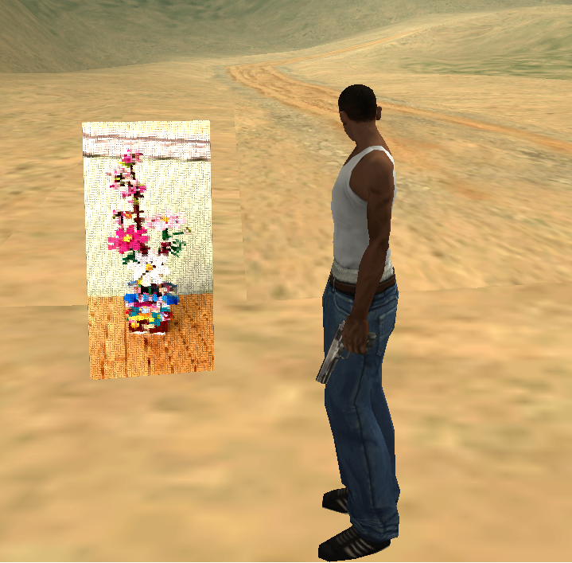
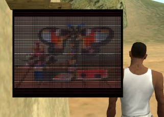

# Samp Vanilla Assets

**Load external media dynamically without cache.**

Rust plugin for open.mp/SA-MP that renders media (image, GIF, video, and YouTube live) on 3D objects using object material text.

<div align="center">

| 3D elements | Gui images |
|:---:|:---:|
|  |  |

</div>

More examples in [`/docs`](docs).

> ⚠️ **Client compatibility:** requires **SA-MP 0.3.DL**. Object material text — the feature used to render media on 3D objects — only exists on 0.3.DL clients. Players on older SA-MP versions won't see the rendered media.

---

## Requirements

- Rust toolchain (rustup + cargo)
- ffmpeg available in PATH
- yt-dlp available in PATH (for YouTube)
- open.mp/SA-MP server with legacy plugin support
- Players connecting with the SA-MP 0.3.DL client

## Build

From the `samp-vanilla-assets` directory:

```bash
cargo +stable-i686-pc-windows-msvc build --release
```

The build generates a DLL under `target/release` (usually named after the crate, but it may vary if the project is renamed).

## Dependencies

This plugin depends on the [SA-MP Streamer Plugin](https://github.com/samp-incognito/samp-streamer-plugin).

Install it following its instructions, then add it to your server's plugin list **before** loading this plugin.

## Server installation

1. Copy the generated DLL to the server `plugins` folder.
2. Make sure `models/screen.dff` and `models/screen.txd` are present in the server `models` folder.
3. In `config.json`, add the plugin name under `pawn.legacy_plugins` (example: `"samp_vanilla_assets"`).
4. Copy `include/samp_vanilla_assets.inc` into your compiler's include path (e.g. `qawno/include`) and `#include <samp_vanilla_assets>` in your script — see [`docs/pawn-include.md`](docs/pawn-include.md) for the full Pawn API and a working example in [`demo/demo.pwn`](demo/demo.pwn).
5. Restart the server.

## Audio

| Setting | Value |
|---|---|
| Internal audio HTTP server bind | `0.0.0.0:7878` |
| Default audio base URL | `http://127.0.0.1:7878` |
| Audio output directory | defined in code (`AUDIO_OUTPUT_DIR`) |

To change bind/port/path, edit the constants in `src/constants.rs` and rebuild.

## Quick troubleshooting

| Symptom | Fix |
|---|---|
| Live stream start error | Confirm `yt-dlp` is in PATH |
| No audio for video/live | Confirm `ffmpeg` is in PATH and port `7878` is free |
| Missing custom screen model | Confirm `screen.dff` and `screen.txd` are inside `models` |
| Native not found | Confirm plugin is loaded in `config.json` and the gamemode was recompiled |
